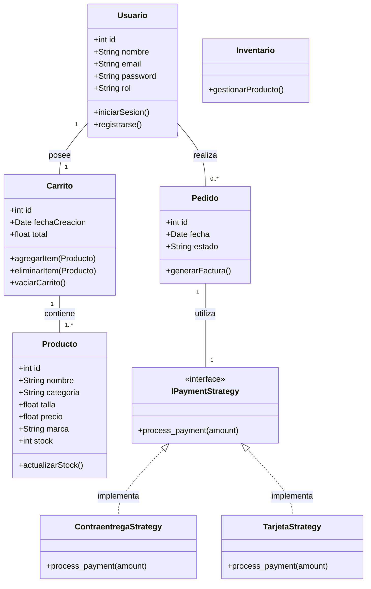
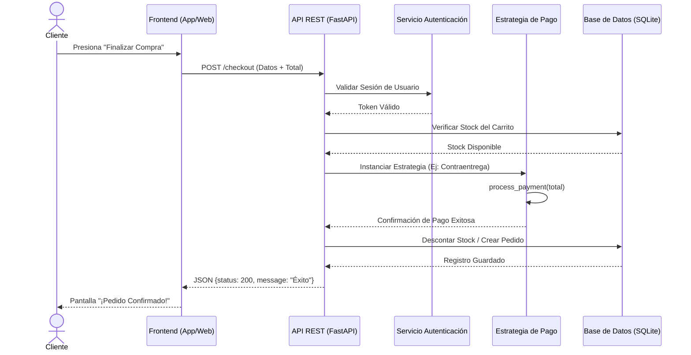

# 📊 Diagramas UML - ZapatoFlex S.A.S.

Aquí tienes el código de los 4 diagramas requeridos. Están escritos en un formato llamado **Mermaid**. 

**¿Cómo verlos y pasarlos a tu PDF?**
1. **Opción 1:** Copia el código que está dentro de los bloques de cada diagrama y pégalo en la página web **[Mermaid Live Editor](https://mermaid.live/)**. Ahí te generará la imagen al instante y podrás descargarla en formato PNG.
2. **Opción 2:** Si instalas la extensión "Markdown Preview Mermaid Support" en Visual Studio Code, podrás verlos ahí mismo.

---

## 1. Diagrama de Casos de Uso
*(Muestra la interacción de los actores con el sistema)*

```mermaid
usecaseDiagram
actor Cliente
actor Administrador
actor SistemaPago

package ZapatoFlex {
  usecase "Registrarse e Iniciar Sesión" as UC1
  usecase "Visualizar Catálogo" as UC2
  usecase "Filtrar por Talla/Color/Precio" as UC3
  usecase "Agregar al Carrito" as UC4
  usecase "Proceso de Compra (Checkout)" as UC5
  usecase "Simulación de Pago" as UC6
  usecase "Ver Historial de Compras" as UC7
  usecase "Gestionar Inventario y Productos" as UC8
}

Cliente --> UC1
Cliente --> UC2
Cliente --> UC3
Cliente --> UC4
Cliente --> UC5
Cliente --> UC7

UC5 .> UC6 : <<include>>
SistemaPago --> UC6

Administrador --> UC1
Administrador --> UC8
```

---

## 2. Diagrama de Clases
*(Muestra las entidades, el Patrón Strategy y sus relaciones)*



---

## 3. Diagrama de Secuencia (Proceso de Compra)
*(Muestra el paso a paso cuando el cliente hace el checkout)*



---

## 4. Diagrama de Despliegue
*(Muestra la arquitectura Client-Server en la Nube y la Base de Datos conectada)*

```mermaid
flowchart TD
    subgraph Capa Cliente
        A[Navegador Web / Cliente]
        M[Futura App Móvil]
    end

    subgraph Nube Pública (Render / AWS / Vercel)
        B{Balanceador de Carga}
        
        subgraph Contenedores Docker
            C[API REST - FastAPI Instancia 1]
            D[API REST - FastAPI Instancia 2]
        end
    end

    subgraph Capa de Datos
        E[(Base de Datos Gestionada)]
        F[Amazon RDS / SQLite Local]
        E --- F
    end

    A -- "HTTP / REST JSON" --> B
    M -- "HTTP / REST JSON" --> B
    B --> C
    B --> D
    
    C -- "Conexión SQL (SQLAlchemy)" --> E
    D -- "Conexión SQL (SQLAlchemy)" --> E
```
